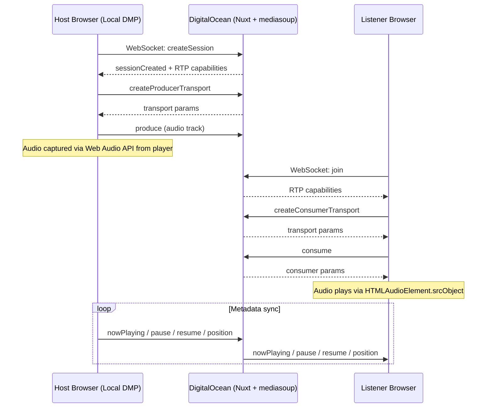

# Music Party Mode (WebRTC with mediasoup)

## Architecture

## Environment Variables

**DigitalOcean server** (`.env`):

- `STREAM=true` -- enables listener/stream mode for the entire app
- `MEDIASOUP_ANNOUNCED_IP=<public-ip>` -- public IP for WebRTC ICE candidates
- `RTC_MIN_PORT=10000`, `RTC_MAX_PORT=10100` -- UDP port range for media

**Host's local DMP** (`.env`):

- `PARTY_URL=https://discodomeuprimo.online` -- remote server URL for signaling

All added to `runtimeConfig` in `[web/nuxt.config.ts](web/nuxt.config.ts)`.

## New Dependencies

- `mediasoup` -- server-side SFU (C++ worker, runs on DigitalOcean only)
- `mediasoup-client` -- client-side WebRTC transport (runs in both host and listener browsers)

## Server-Side (Nuxt/Nitro)

### 1. Mediasoup Worker Plugin -- `web/server/plugins/mediasoup.ts`

- Initialize mediasoup Worker(s) on server start (only when `STREAM=true` or when the server should act as SFU)
- Configure `rtcMinPort` / `rtcMaxPort` from env vars
- Store worker reference in a shared utility

### 2. Session Manager -- `web/server/utils/party.ts`

- Singleton managing the single active session
- Creates mediasoup Router with Opus codec configuration
- Creates WebRtcTransports (one for host producer, one per listener consumer)
- Creates Producers (host audio) and Consumers (one per listener)
- Tracks connected peers and listener count
- Handles cleanup on session end or host disconnect

### 3. WebSocket Signaling -- `web/server/routes/_ws.ts`

Using Nitro's built-in `defineWebSocketHandler`. Protocol messages:

**Host -> Server:** `createSession`, `createProducerTransport`, `connectTransport`, `produce`, `nowPlaying`, `pause`, `resume`, `position`, `endSession`

**Listener -> Server:** `join`, `createConsumerTransport`, `connectTransport`, `consume`, `resumeConsumer`

**Server -> Host:** `sessionCreated`, `transportCreated`, `produced`, `listenerCount`

**Server -> Listener:** `transportCreated`, `consumed`, `nowPlaying`, `pause`, `resume`, `position`, `sessionEnded`

### 4. Session Status API -- `web/server/api/party/status.get.ts`

- Returns whether a session is active, current track metadata, listener count
- Used by listeners on page load to check stream availability

## Client-Side

### 5. Stream Mode Composable -- `web/composables/useStreamMode.ts`

- Returns `isStreamMode` computed from `runtimeConfig.public.stream`
- Used across all components to conditionally hide/show UI elements

### 6. Host Party Composable -- `web/composables/usePartyHost.ts`

- Connects to remote signaling server at `PARTY_URL`
- Captures audio from the player's `HTMLAudioElement` via Web Audio API:
  - `AudioContext` -> `createMediaElementSource(audio)` -> `createMediaStreamDestination()`
  - Also connects to `ctx.destination` so host still hears audio
- Loads mediasoup-client `Device` with server's RTP capabilities
- Creates `SendTransport` and `Producer` for the audio track
- Watches player store state changes and sends metadata (nowPlaying, pause, resume, position every ~1s)
- Provides reactive state: `isActive`, `sessionId`, `listenerCount`, `inviteUrl`

### 7. Listener Party Composable -- `web/composables/usePartyListener.ts`

- Auto-connects to WebSocket signaling on the same server
- Loads mediasoup-client `Device`
- Creates `RecvTransport` and `Consumer`
- Attaches received `MediaStreamTrack` to an `HTMLAudioElement` via `srcObject`
- Receives and stores metadata (nowPlaying, pause, resume, position)
- Auto-reconnects on failure
- Provides reactive state: `isConnected`, `currentTrack`, `isPlaying`, `currentTime`, `duration`

### 8. Modified Player Store -- `[web/stores/player.ts](web/stores/player.ts)`

- Expose `getAudio()` in the return value so the host composable can capture it
- When in stream mode (`STREAM=true`), the store defers to the listener composable for track state
- The player's `togglePlay()` in stream mode pauses/resumes the local audio element (not the host's playback)
- Volume/mute controls work locally as usual

### 9. Party Page -- `web/pages/party.vue`

- **Host mode** (no `STREAM`): Shows session management UI
  - "Create Session" button
  - When active: invite URL (copyable), listener count, stream status, "End Session" button
- **Stream mode** (`STREAM=true`): Redirects to home or shows "Listening to stream" status

### 10. AudioPlayer Modifications -- `[web/components/player/AudioPlayer.vue](web/components/player/AudioPlayer.vue)`

- **Host mode**: Add a broadcast/party icon button that navigates to `/party`; when session is active, show a pulsing indicator
- **Stream mode**: Hide prev/next, shuffle, seek, favorite, playlist controls. Keep play/pause, volume, track info, progress bar (read-only, synced)

## Conditional UI (Stream Mode)

When `STREAM=true`, hide the following across the app using `v-if="!isStreamMode"`:

- **Play buttons** in: `TrackList.vue`, `ReleaseCover.vue`, `ArtistReleases.vue`, `ReleaseGrid.vue` (home), `SearchDropdown.vue`, `timeline/index.vue`
- **Favorite buttons** in: `TrackList.vue`, `AudioPlayer.vue`, `favorites.vue`
- **Playlist features**: Hide `/playlists` nav links in `Sidebar.vue` and `MobileNav.vue`. The playlist pages themselves become inaccessible (middleware redirect or hidden nav)
- **Favorites page**: Hide nav link, same approach

The `useStreamMode()` composable keeps this centralized -- components just check one boolean.

## Deployment Notes

- **DigitalOcean firewall**: Open UDP ports `10000-10100` for mediasoup RTC traffic
- **mediasoup build deps**: Ensure `python3`, `make`, `gcc`/`g++` are installed on the server (required for native C++ worker compilation during `npm install`)
- **Single session**: Only one party session at a time; creating a new one ends the previous

## File Summary

| Action | File                                                 |
| ------ | ---------------------------------------------------- |
| New    | `web/server/plugins/mediasoup.ts`                    |
| New    | `web/server/utils/party.ts`                          |
| New    | `web/server/routes/_ws.ts`                           |
| New    | `web/server/api/party/status.get.ts`                 |
| New    | `web/composables/useStreamMode.ts`                   |
| New    | `web/composables/usePartyHost.ts`                    |
| New    | `web/composables/usePartyListener.ts`                |
| New    | `web/pages/party.vue`                                |
| Modify | `web/stores/player.ts`                               |
| Modify | `web/components/player/AudioPlayer.vue`              |
| Modify | `web/nuxt.config.ts`                                 |
| Modify | `web/package.json` (add mediasoup, mediasoup-client) |
| Modify | `web/components/TrackList.vue`                       |
| Modify | `web/components/release/ReleaseCover.vue`            |
| Modify | `web/components/artist/ArtistReleases.vue`           |
| Modify | `web/components/home/ReleaseGrid.vue`                |
| Modify | `web/components/layout/SearchDropdown.vue`           |
| Modify | `web/components/layout/Sidebar.vue`                  |
| Modify | `web/components/layout/MobileNav.vue`                |
| Modify | `web/pages/favorites.vue`                            |
| Modify | `web/pages/timeline/index.vue`                       |

